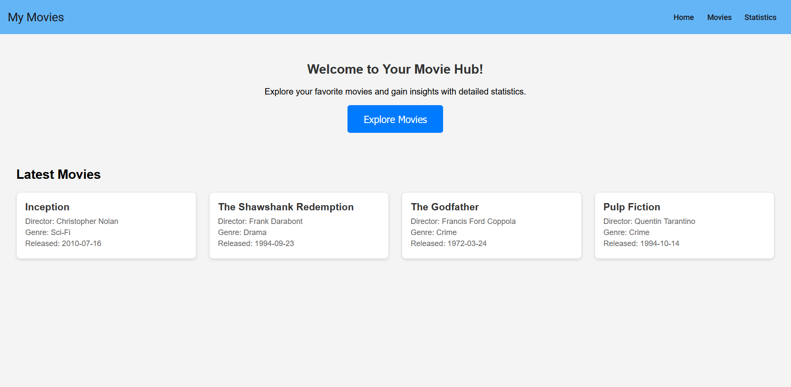
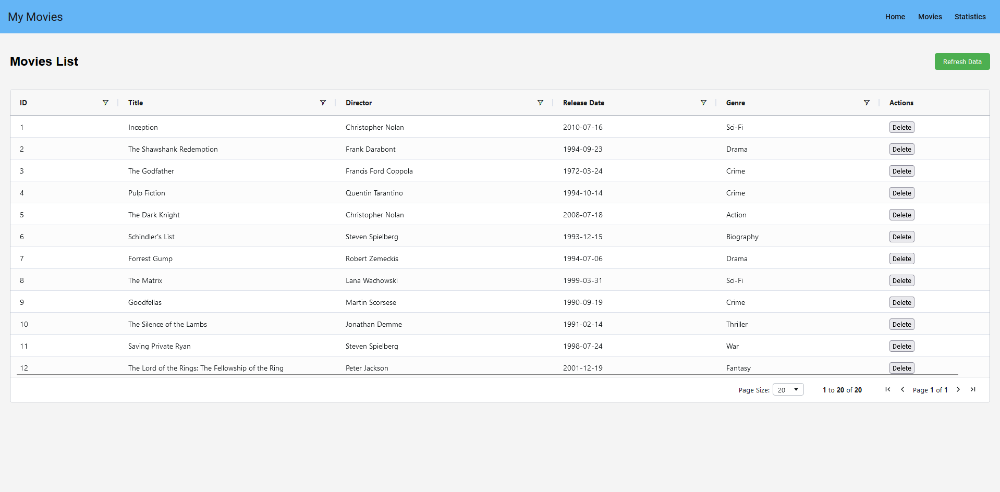
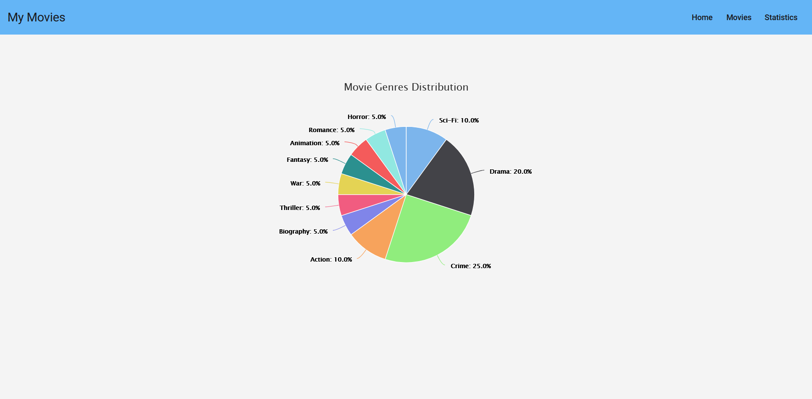

# Projet_Node-React

# User Guide for Movie Management Project

## Overview

This project is a web application that allows users to explore and manage a list of movies. It consists of three main pages: **Home**, **Movies**, and **Statistics**.

- **Home Page**: The landing page of the application with a navigation bar to switch between different pages. 
- **Movies Page**: A page that displays a list of movies using the ag-grid package. Users can manage movie records through CRUD operations. 
- **Statistics Page**: A page displaying the distribution of movie genres in a pie chart for visual analysis. 

## Features

### 1. **Home Page**

- **Navigation Bar**: The navigation bar is located at the top of the page, allowing users to navigate between the **Home**, **Movies**, and **Statistics** pages.
- **Explore Movies Button**: On the Home page, you can click the **Explore Movies** button to navigate directly to the **Movies** page.

### 2. **Movies Page**

The **Movies** page displays a list of movies fetched from the backend API. It uses the **ag-grid** package to provide an interactive, sortable table. Key features include:

- **Movie List**: The list of movies is displayed in a table with the following columns:
    - **Movie Title**
    - **Genre**
    - **Release Date**
    - **Other relevant details**

- **Delete Button**: For each movie row in the table, there is a **Delete** button that allows you to remove the movie from the list. Clicking the **Delete** button will delete the respective movie from the backend.

- **Refresh Data Button**: If you need to refresh the movie list, simply click the **Refresh Data** button. This will fetch the latest movie data from the backend API and update the table accordingly.

### 3. **Statistics Page**

The **Statistics** page provides a visual representation of movie genres using a pie chart using **Highcharts**. The pie chart displays the distribution of different genres within the movies.

- **Genre Distribution**: The pie chart is dynamically generated from the movie data and shows how the movies are distributed across various genres.

## How to Use

### Navigation

- **Home Page**: Upon visiting the application, you'll be on the Home page. From here, you can navigate to either the **Movies** page by clicking the **Explore Movies** button or to the **Statistics** page using the navigation bar.

- **Movies Page**: On the Movies page, you can:
    1. View and interact with the list of movies in the table.
    2. Delete a movie by clicking the **Delete** button on any row.
    3. Refresh the movie data by clicking the **Refresh Data** button to pull the latest data from the backend.

- **Statistics Page**: View the pie chart to understand the distribution of movie genres in the system. The chart is automatically updated based on the movie data in the backend.

## How to run the project

```bash
git clone https://github.com/ad-713/Final_Project.git
cd Final_Project
```
To run the backend:
```bash
cd backend
npm install -g nodemon
npm intsall
npm run dev
```
Then click on this link
http://localhost:3000/

To run the frontend:
```bash
cd frontend
npm install
ng serve
```
Then click on this link
http://localhost:4200/


